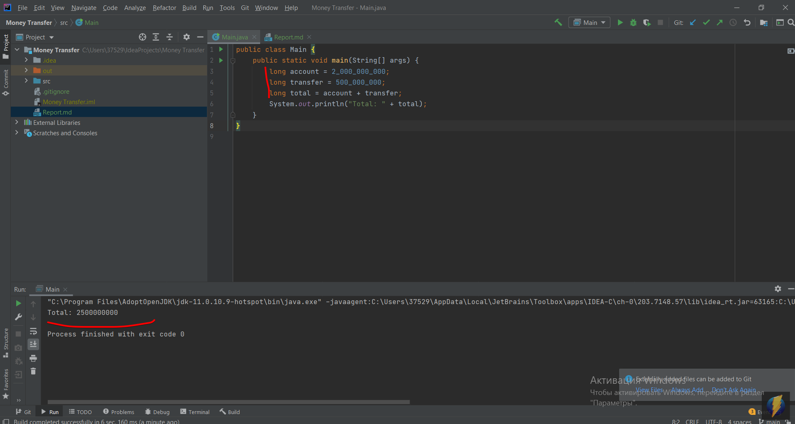

# Отчёт о тестировании приложения "Money Transfer"

## Краткое описание

Проводилось санитарное тестирование приложения "Money Transfer".
Оно служит для отслеживания состояния счетов клиентов. 
При переводе суммы на счет, зачислении на счет не происходит.

## Описание тестов 
Проводилось нефункциональное тестирование. Тестировались целочисленные типы данных.
Менялся тип int на тип long. 
* Одно тестирование с типом int прошло с багом.
* Одно тестирование с типом long прошло успешно.

## Результаты 
1. 50% успешных, 50% не успешных тестов
2. [Не работает переменная для хранения итогового значения](https://github.com/HalinaHrekava/Money-Transfer/issues/1)
   
## Общие рекомендации
Т.к. int — 4 байта, от -2 147 483 648 до 2 147 483 647 (-232 до 232);
то происходит выход за границы типа int (итоговое значение равно 2 500 000 000) и 
в коде нужно поменять переменнst для хранения данных с int на long

